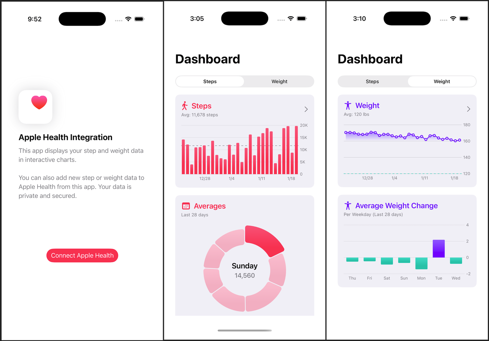

# Health Lens
Health Lens integrates Apple Health to show your latest step and weight data in animated, interactive Swift Charts. You can also see your average steps and weight gain/loss for each weekday for the past 28 days.

Health Lens also allows you to upload new step or weight data to the Apple Health app.

# Technologies Used
* SwiftUI
* HealthKit
* Swift Charts
* Swift Algorithms

# Completeness
* Error handling & alerts
* Empty states
* Permission Priming
* Text input validation
* Basic unit tests
* Basic accessibility
* Privacy Manifest

